Project Sentinel AI

```mermaid
graph LR
    A((📡 Signal Capture)) --> B([🎯 Noise Filtering & Claim Isolation]);
    B --> C{🧠 Autonomous Agent Swarm};

    subgraph "Parallel Investigation"
        C --> D[Verify Official Channels];
        C --> E[Cross-Reference Media];
        C --> F[Scan for Known Hoaxes];
    end

    D --> G([⚖️ Evidence Synthesis]);
    E --> G;
    F --> G;

    G --> DB[(Supabase DB Write)];
    DB --> H{📢 Real-Time Truth Broadcast};

    subgraph "Instant Dissemination"
        H --> I[🌐 Live Timeline Update];
        H --> J[📧 Follower Email Alert];
    end

    %% Styling
    style A fill:#e0f2fe,stroke:#3b82f6,stroke-width:2px,stroke-dasharray: 5 5
    style B fill:#e0f2fe,stroke:#3b82f6,stroke-width:2px
    style C fill:#dbeafe,stroke:#3b82f6,stroke-width:3px
    style D fill:#e0e7ff,stroke:#6366f1,stroke-width:2px
    style E fill:#e0e7ff,stroke:#6366f1,stroke-width:2px
    style F fill:#e0e7ff,stroke:#6366f1,stroke-width:2px
    style G fill:#d1fae5,stroke:#10b981,stroke-width:2px
    style DB fill:#e5e7eb,stroke:#4b5563,stroke-width:2px
    style H fill:#fef3c7,stroke:#f59e0b,stroke-width:3px
    style I fill:#fce7f3,stroke:#ec4899,stroke-width:2px
    style J fill:#fce7f3,stroke:#ec4899,stroke-width:2px
```

DEMO Link : https://dextrobyt.github.io/SentinelAI/

Clarity in Crisis: An Autonomous AI Engine for Real-Time Truth Verification

Introduction

Welcome to the project submission for Sentinel AI for the Mumbai Hacks 2025 Hackathon. This repository contains the UI/UX mockup and foundational documentation for an autonomous system designed to combat misinformation during critical events.

Our core mission is to provide the public with a single, trusted source of truth through a continuously and automatically updated timeline of verified information. This mockup showcases the user-facing portion of our application, the Veritas Timeline, demonstrating the clarity and usability of our final product.

Live Mockup Showcase

We have created a high-fidelity, interactive mockup to showcase the look, feel, and core user flow of our application.

The mockup is divided into three interconnected pages:

index.html (Homepage & Dashboard):

This is the main landing page for Sentinel AI.

It features a professional dashboard of "Live & Trending Crises," demonstrating how users can get an immediate overview of ongoing events.

It also explains our unique 5-step agentic verification pipeline.

veritas_timeline.html (The Core Experience):

This page demonstrates the real-time, verified timeline—our "single source of truth."

Clicking on a crisis from the homepage will lead here, showcasing a detailed, chronological feed of updates.

Interactive Feature: The timeline includes functional filters for "All," "Verified," and "Debunked" claims, allowing for a more focused user experience.

authentication.html (Professional UI/UX):

This page showcases a modern, professional authentication screen using glassmorphism effects.

It demonstrates our commitment to a high-quality user experience from the very first interaction.

Key Innovations & Differentiators

Sentinel AI is fundamentally different from existing fact-checking platforms because it is proactive, not reactive.

Autonomous Agentic System: Our core innovation is an AI engine that doesn't wait for human input. It autonomously scans, identifies, and verifies claims using a team of specialized AI agents.

Speed & Scale: By using an AI-first approach, we can verify information at a speed and scale that is impossible for human-driven fact-checking, allowing us to get ahead of misinformation before it goes viral.

Centralized & User-Friendly Dashboard: We solve the problem of information fragmentation. The Veritas Timeline provides a single, easy-to-read dashboard, eliminating the need for users to hunt across multiple news sites and social media feeds.

Personalized & Critical Alerts: Users can "follow" events and receive customized email notifications. Our system is designed to push immediate, high-priority alerts for debunked critical misinformation, ensuring public safety.

Technical Vision

While this is a UI mockup, it is backed by a comprehensive technical blueprint. Our planned stack is modern, scalable, and optimized for rapid development.

Backend: Python (FastAPI)

Frontend: Next.js & TypeScript

AI Orchestration: LangChain & LangGraph

BaaS: Supabase (PostgreSQL, Realtime, Auth)

Deployment: Vercel & Railway

Thank you for your time and consideration. We are confident that Project Sentinel AI represents a significant step forward in the fight against misinformation.
